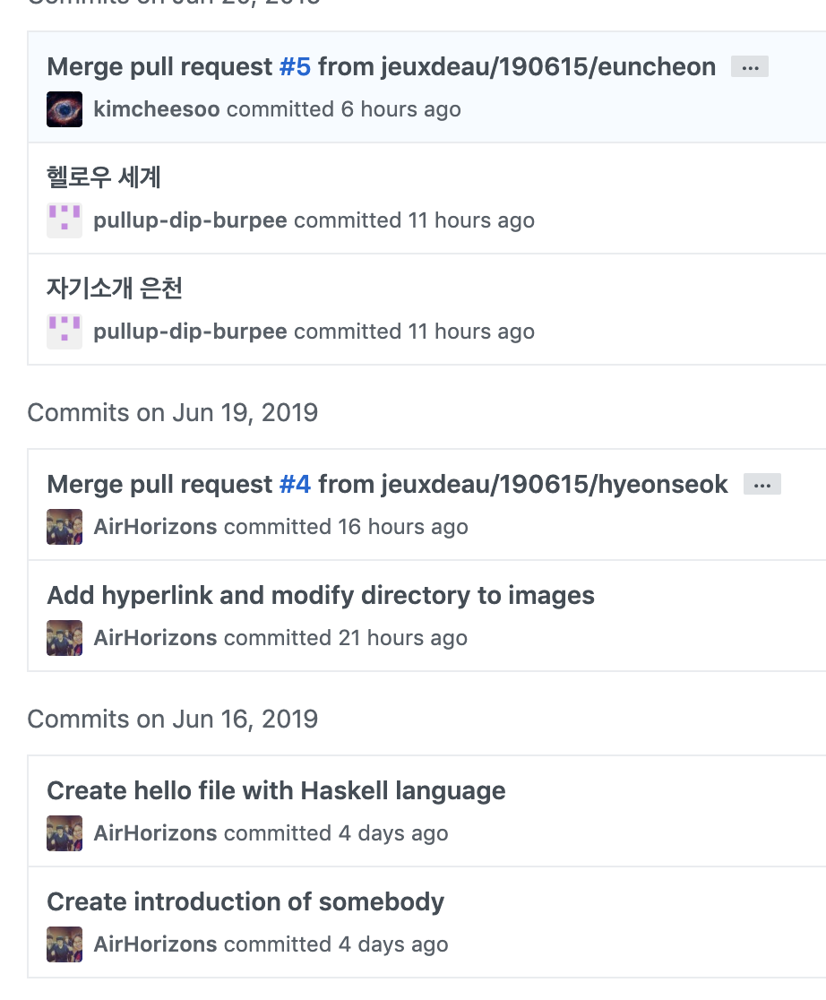
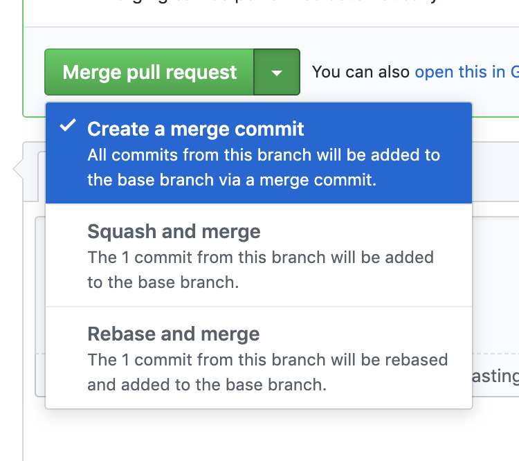
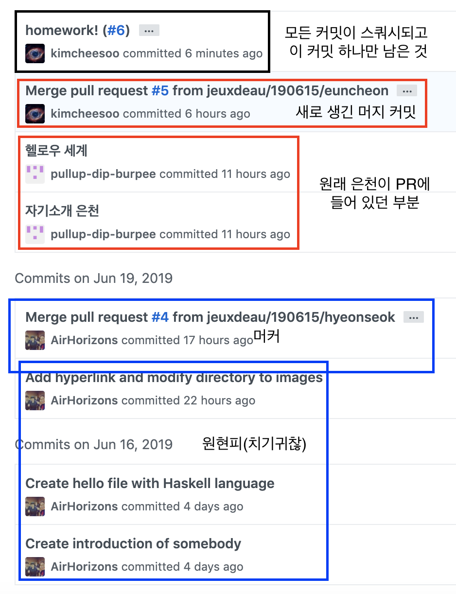

# maratangs#1

## Git과 GitHub: 숙제 리뷰
- 숙제의 난이도는 어땠습니까? (상/중/하)
- 숙제의 분량은 어땠습니까? (많다, 적당하다, 적다)
- 숙제에서 무엇을 배웠습니까? 여러분에게 도움이 되었습니까?
- 숙제는 즐거웠습니까? (즐거웠다/그저 그랬다/재미없었다)

## 1# git과 GitHub
> 뭔지 다 안다고 하면 생략 or 전/현직 소개원실 조교님의 명강

## 2# 커밋 메시지 잘 쓰기
[몇번이나 같은 링크를 올리는지 모르겠지만 부디 시간을 내서 읽어주시길 바랐지만 아무도 그러지 않을 것이 뻔하므로 같이 읽자는 의미에서 한 번 더 링크를 건다…](https://djkeh.github.io/articles/How-to-write-a-git-commit-message-kor/)

### 세 줄 요약: 문법편
1. 제목은 **명령형(동사 원형)** 으로 시작한다. `숙제 하면서 왜 그런지 생각해봤니?`
2. 제목 첫 글자는 대문자로 적는다.
3. 제목 끝에는 마침표(.)를 붙이지 않는다.

### 세 줄 요약: 활용편
1. 커밋의 제목은 그 커밋이 무슨 일을 하는지 정확히 나타낼 수 있어야 합니다.
2. 그러기 위해서는 한 개의 커밋이 한 번에 한 가지 일만 하도록 커밋의 단위를 잘 나누어야 합니다.
3. 더 설명이 필요하다면 제목 다음에 한 줄을 띄고 커밋 본문을 작성하세요.

### 커밋 메시지 되돌아보기

> 이 시점에서 라이브 코딩을 시작하고 같이 리뷰를 해보자~

## 3# 코드 리뷰
## 4# 머지하는 방법

## 5# 마크다운
